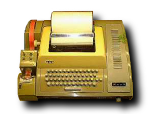

# Exercise 1 - Getting started

The goal of this exercise is to teach you how to get started with the shell.

You will learn to:

- Tell the difference between terminals, consoles and shells
- Install required software (if needed)
- Open a terminal
- Use the command line

## Required software and tools for this exercise

- Bash
- A terminal

## 1.1 - Terminals, consoles and shells

:book: We often see the terms "console", "terminal" and "shell" being used interchangabily when describing command line interfaces. Let's go through each term to understand what they really mean and how they relate.

### 1.1.2 - Terminals

#### History

:book: A terminal, or computer terminal is a hardware device used to enter data into and read data from a computer. Early computers did not have screens, so in order to use the computer you needed to use a terminal. Early terminals were teleprinters/teletypewriters (TeleTYpewriter, TTY), which consisted of a keyboard and a printer. When you type on it, you see the text on a piece of paper and at the same time inputing the texting into a computer. When the computer replies, the printer automatically prints out the reply on the same paper. Each computer could be used by multiple users at the same time by having multiple TTYs connected.



Later terminals replaced the printer with a screen, called video terminals:


:book: These video terminals were also called "dumb terminals", because the real work was being done on the computer which the terminal was connected to.

#### Modern terminals

:book: When we refer to a terminal in the software sense, we are referring to a literal software version of a TTY. Software terminals display text output, takes user input and passes it on. The terminal does not actually do any processing of output or input. Software termnials are also called terminal emulators, because of the way they _emulate_ the early video terminals.

:book: Terminal emulators have other useful features like search, tabs, split screen, visual appearance customization and much more.

:exclamation: Linux has a default terminal that come preinstalled in evry Linux distrobution, depending on what distrobution you use. MacOS has a default terminal aptly named "Terminal". Windows sadly (as of august 2022) does not yet come with a "proper" default terminal, but Microsoft recommends installing [Windows Terminal](https://docs.microsoft.com/en-us/windows/terminal/).

Examples of alternative terminal emulators:

##### Windows Terminal (Windows)


[Windows Terminal](https://docs.microsoft.com/en-us/windows/terminal/)

##### iTerm (Mac OS)


[iTerm](https://iterm2.com/)

##### Terminator (Linux)


[Terminator](https://gnome-terminator.org/)

##### Visual Studio Code integrated terminal (Windows, MacOS, Linux)


[Visual Studio Code](https://code.visualstudio.com/)

### 1.1.3 - Consoles

:book: A console in the historical context of computers is a cabinet with a screen and a keyboard combined inside it. The early video terminals consisted of a physical device called a _console_ and a piece of software running on it to  handle input and output called the _terminal_.

:book: In the context of modern terminals the terms _console_ and _terminal_ are synonymous. In this workshop we will use the term _terminal_ to avoid confusion.

### 1.1.4 - Shells

:book: A shell is a program that the terminal sends user input to. The shell processes the input and generates an output which the terminal displays.

Examples of some shells:

- bash, zsh, sh (Unix shells)
- Powershell, Command Prompt (Windows shells)

:exclamation: It is important to know that a terminal can be used with multiple shells - one terminal, multiple shells.

#### 1.1.4.1 - Unix shells

:book: Unix shells (like bash and sh) are shells that originally was created to be used on early Unix-based computers in the 70s. They later gained so much popularity that operating systems like Linux and MacOS as default came preinstalled with Unix shells. Today there are many different variants of Unix shells available.

##### Bash shell

:book: [Bash](https://www.gnu.org/software/bash/), or _Bourne-again Shell_ (1989-today) is one of the most popular Unix shells (and shells in general) today. It comes preinstalled with Linux and MacOS.

:exclamation: This workshop is based on learning Bash because of it's wide adoption and popularity.

#### 1.1.4.2 - Windows shells

:book: Windows shells (like Command Prompt and Powershell) are shells created to be used on Windows-based computers. In general, Windows shells are only used on Windows-based computers, even though a variant of Powershell exists that can be installed in Linux and Mac OS as well.

:exclamation: In this workshop we will _not_ be using any of these shells.

## 1.2 - Installing the required software

:book: In order to do the exercises in this workshop you need the following installed:

- Bash shell
- A terminal

### 1.2.1 - Linux-users

:book: All Linux distributions comes with Bash and some flavor of terminal application, so you can safely skip this step if you are a Linux user.

### 1.2.2 - Mac-users

:book: Mac OS comes with Bash and a terminal application called _Terminal_, so you can safely skip this step if you are a Mac user.

### 1.2.3 - Windows-users

:book: Windows does not come preinstalled with Bash. The easiest way to install Bash is to install [Git for Windows](https://git-scm.com/download/win), which includes Bash.

:pencil2: Download and install [Git for Windows](https://git-scm.com/download/win) if you don't have it installed already.

:book: Windows includes a default terminal (called conhost, or Console Host) which can be used with Bash, so strictly speaking you do not _need_ to install a terminal. However, conhost has a very poor user experience. We recommend that you install Microsoft's modern terminal called Windows Terminal.

:pencil2: (Optional) Follow [the official install instructions](https://docs.microsoft.com/en-us/windows/terminal/install) to install Windows Terminal.

## Summary

- Terms you learned in this exercise:
  - Console, shell, terminal
  - Unix shell, Windows shell
  - bash, sh, powershell
  - CLI

> :exclamation: Use `> :exclamation:` to indicate something important. Lorem ipsum dolor sit amet, consectetur adipiscing elit. Etiam viverra in ex quis efficitur. Morbi dapibus aliquet cursus. Suspendisse potenti. Nam aliquet dolor odio. Interdum et malesuada fames ac ante ipsum primis in faucibus. Vestibulum ornare libero convallis, posuere lectus id, porta libero. Duis non tellus sapien.

> :question: Use `> :question:` for open-ended questions to the reader ("What do you think would happen if..."). Lorem ipsum dolor sit amet, consectetur adipiscing elit. Etiam viverra in ex quis efficitur. Morbi dapibus aliquet cursus. Suspendisse potenti. Nam aliquet dolor odio. Interdum et malesuada fames ac ante ipsum primis in faucibus. Vestibulum ornare libero convallis, posuere lectus id, porta libero. Duis non tellus sapien.

> :poop: Use `> :poop:` to indicate a bad practice (don't-do-this). Lorem ipsum dolor sit amet, consectetur adipiscing elit. Etiam viverra in ex quis efficitur. Morbi dapibus aliquet cursus. Suspendisse potenti. Nam aliquet dolor odio. Interdum et malesuada fames ac ante ipsum primis in faucibus. Vestibulum ornare libero convallis, posuere lectus id, porta libero. Duis non tellus sapien.

:pencil2: Use `:pencil2:` to indicate a task (do-this-now). This replaces bulletpoints.  
:pencil2: Use `:pencil2:` to indicate a task (do-this-now). This replaces bulletpoints.<br/>
:pencil2: Use `:pencil2:` to indicate a task (do-this-now). This replaces bulletpoints.  

(Note: Use two spaces at the end of a line or `<br/>` to force a new line without using lists/bulletpoints)

:star: Use `:star:` to indicate a bonus task. This replaces bulletpoints.<br/>
:star: Use `:star:` to indicate a bonus task. This replaces bulletpoints.<br/>
:star: Use `:star:` to indicate a bonus task. This replaces bulletpoints.<br/>

## 1.2 {Exersice section}

Any reference to something in code should be wrapped in either a `inline code` section or a
```
code block
```

Always highlight with the programming language if possible:

```javascript
function code() {
  return 'awesome';
}
```

Use the `diff` code block to indicate changes in code

```diff
- foo
+ bar
```

Use the `<kbd>` HTML tag to indicate keyboard keys:

<kbd>CTRL</kbd> + <kbd>ALT</kbd> + <kbd>C</kbd>

`<kbd>CTRL</kbd> + <kbd>ALT</kbd> + <kbd>C</kbd>`

Include a link to the next exercise, or clearly state that this is the last exercise of the workshop.

`### [Go to exercise 2 :arrow_right:](../exercise-2/README.md)`

### [Go to exercise 2 :arrow_right:](../exercise-2/README.md)