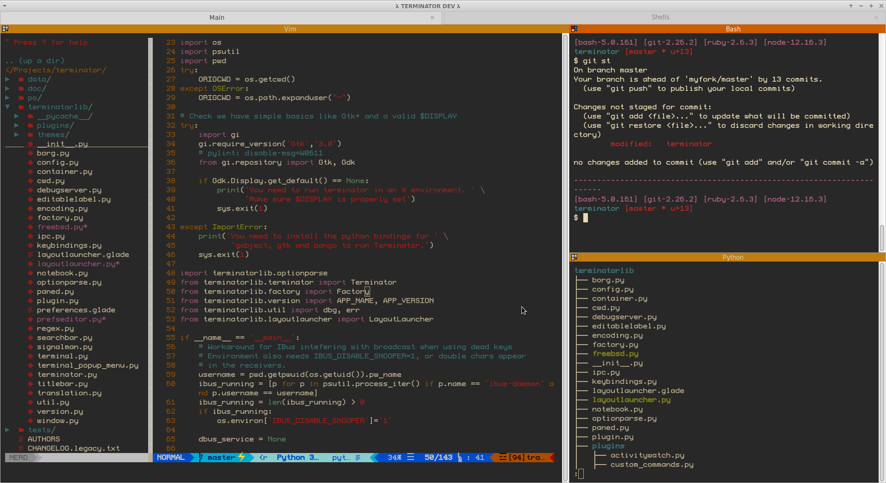

# Exercise 1 - Getting started

The goal of this exercise is to teach you how to get started with the shell.

You will learn to:

- Tell the difference between terminals, consoles and shells
- Install required software (if needed)
- Open a terminal

## Required software and tools for this exercise

- Bash
- A terminal

---

## 1.1 - Terminals, consoles and shells

:book: We often see the terms "console", "terminal" and "shell" being used interchangabily when describing command line interfaces. Let's go through each term to understand what they really mean and how they relate.

### 1.1.2 - Terminals

#### History

:book: A terminal, or computer terminal is a hardware device used to enter data into and read data from a computer. Early computers did not have screens, so in order to use the computer you needed to use a terminal. Early terminals were teleprinters/teletypewriters (TeleTYpewriter, TTY), which consisted of a keyboard and a printer. When you type on it, you see the text on a piece of paper and at the same time inputing the texting into a computer. When the computer replies, the printer automatically prints out the reply on the same paper. Each computer could be used by multiple users at the same time by having multiple TTYs connected.

Later terminals replaced the printer with a screen, called video terminals:

:book: These video terminals were also called "dumb terminals", because the real work was being done on the computer which the terminal was connected to.

#### Modern terminals

:book: When we refer to a terminal in the software sense, we are referring to a literal software version of a TTY. Software terminals display text output, takes user input and passes it on. The terminal does not actually do any processing of output or input. Software terminals are also called terminal emulators, because of the way they _emulate_ the early video terminals.

:book: Terminal emulators have other useful features like search, tabs, split screen, visual appearance customization and much more.

:exclamation: Linux has a default terminal that come preinstalled in every Linux distribution, depending on what distribution you use. MacOS has a default terminal aptly named "Terminal". Windows 11 and later come with [Windows Terminal](https://docs.microsoft.com/en-us/windows/terminal/) installed as the default terminal.

Examples of alternative terminal emulators:

##### iTerm (macOS)

[iTerm](https://iterm2.com/)

##### Terminator (Linux)

[Terminator](https://gnome-terminator.org/)

##### Visual Studio Code integrated terminal (Windows, MacOS, Linux)

[Visual Studio Code](https://code.visualstudio.com/)

### 1.1.3 - Consoles

:book: A console in the historical context of computers is a cabinet with a screen and a keyboard combined inside it. The early video terminals consisted of a physical device called a _console_ and a piece of software running on it to  handle input and output called the _terminal_.

:book: In the context of modern terminals the terms _console_ and _terminal_ are synonymous. In this workshop we will use the term _terminal_ to avoid confusion.

### 1.1.4 - Shells

:book: A shell is a program that the terminal sends user input to. The shell processes the input and generates an output which the terminal displays.

Examples of some shells:

- bash, zsh, sh (Unix shells)
- Powershell, Command Prompt (Windows shells)

:exclamation: It is important to know that a terminal can be used with multiple shells - one terminal, multiple shells.

#### 1.1.4.1 - Unix shells

:book: Unix shells (like bash and sh) are shells that originally was created to be used on early Unix-based computers in the 70s. They later gained so much popularity that operating systems like Linux and MacOS as default came preinstalled with Unix shells. Today there are many different variants of Unix shells available.

##### Bash shell

:book: [Bash](https://www.gnu.org/software/bash/), or _Bourne-again Shell_ (1989-today) is one of the most popular Unix shells (and shells in general) today. It comes preinstalled with Linux and MacOS.

:exclamation: This workshop is based on learning Bash because of it's wide adoption and popularity.

#### 1.1.4.2 - Windows shells

:book: Windows shells (like Command Prompt and Powershell) are shells created to be used on Windows-based computers. In general, Windows shells are only used on Windows-based computers, even though a variant of Powershell exists that can be installed in Linux and macOS as well.

:exclamation: In this workshop we will _not_ be using any of these shells.

---

## 1.2 - Installing the required software

:book: In order to do the exercises in this workshop you need the following installed:

- Bash shell
- A terminal

### 1.2.1 - Linux-users

:book: All Linux distributions comes with Bash and some flavor of terminal application, so you can safely skip this step if you are a Linux user.

### 1.2.2 - Mac-users

:book: macOS comes with Bash and a terminal application called _Terminal_, so you can safely skip this step if you are a Mac user.

### 1.2.3 - Windows-users

:book: Windows does not come preinstalled with Bash. The easiest way to install Bash is to install [Git for Windows](https://git-scm.com/download/win), which includes Bash ("Git Bash").

:pencil2: Download and install [Git for Windows](https://git-scm.com/download/win) if you don't have it installed already.

:book: Git Bash comes included with a terminal (called Mintty), so strictly speaking you do not _need_ to install a separate terminal application. However, Mintty has a very poor user experience. We recommend that you use Microsoft's modern terminal called Windows Terminal. It comes preinstalled in Windows 11 or later.

:pencil2: (Optional) If you are on Windows 10 or earlier, follow [the official install instructions](https://docs.microsoft.com/en-us/windows/terminal/install) to install Windows Terminal.

:bulb: __Tip for experienced users:__ If you want a real, proper Linux environment in Windows, you can install [Windows Subsystem For Linux](https://docs.microsoft.com/en-us/windows/wsl/), or WSL. Note that this is out of scope for this workshop, as the install process is much more comprehensive than just installing an application. If you decide to install WSL, the install time is usually around 10 minutes (depending on Internet speeds and your computer). Windows Terminal is recommended in combination with WSL. :warning: Be warned if you have any problems installing or setting up WSL, you are on your own. :warning:

---

## 1.3 - Opening the terminal

### 1.3.1 - Linux-users

:book: In order to open the default terminal app in Linux you need to know what distribution of Linux you have installed. Here are the names of some default terminals:

- Terminal (GNOME-based distros)
- konsole (KDE-based distros)

#### 1.3.1.1 - Ubuntu

:pencil2: Search for the Terminal app by selecting the _Show Applications_ button at the bottom left of the screen, then type "terminal" into the search field at the top of the screen. Select "Terminal" to open.

The result should be something like this:

#### 1.3.1.2 - Mint Linux

:pencil2: Open the Mint Menu by selecting the green button at the bottom left of the screen. 
:pencil2: Click on the terminal icon in the left side of the menu.

The result should be something like this:

#### 1.3.1.x - Other distros

Google is your friend :)

### 1.3.2 - Mac-users

:pencil2: Follow the [offical guide from Apple](https://support.apple.com/no-no/guide/terminal/apd5265185d-f365-44cb-8b09-71a064a42125/mac) on how open the Terminal app included in macOS.

### 1.3.3 - Windows-users

:pencil2: Open "Git Bash" from the Start menu.

The result should be something like this:

#### Windows Terminal users

:pencil2: If you have Windows Terminal installed, open it from the Start menu.

The result should be something like this:

:pencil2: Windows Terminal includes shortcuts to open several different shells, and Powershell is the default shell (can be configured). To open Git Bash, press the "down-arrow"-button (next to the "new tab"/`+` button) and select "Git Bash" from the list of shells:

:exclamation: Not seeing Git Bash in the list? Following [this guide](https://www.timschaeps.be/post/adding-git-bash-to-windows-terminal/) to add Git Bash to Windows Terminal.

---

## Summary

- You learned the basic terminology:
  - Console, shell, terminal
  - Unix shell, Windows shell
  - bash, sh, powershell
  - CLI
- You learned how to install and open a terminal

### [Go to exercise 2 :arrow_right:](exercise-2.md)
