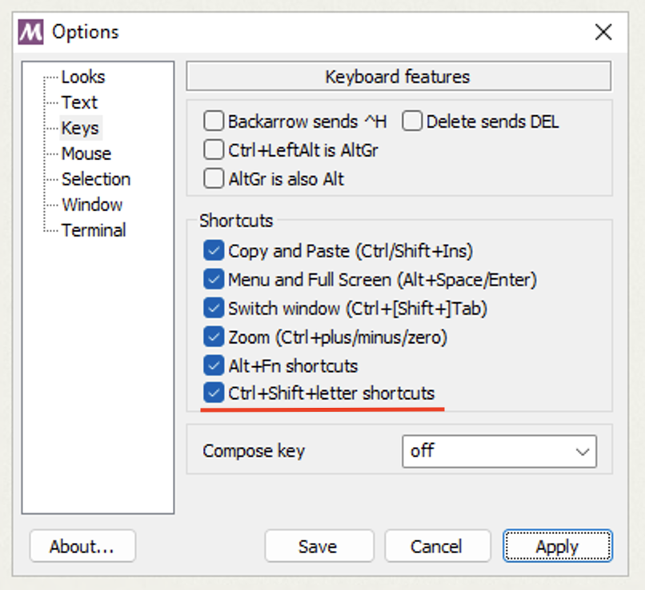

# Exercise 2 - Basics of the shell

You will learn to:

- Understand how the command line works
- Navigate through files and directories using a shell
- Use the clipboard
- Understand what commands are
- Understand how variables work

:book: Check out the [main page](../README.md) where we've listed some of the most commonly used commands (Helpful resources section).

---

## 2.1 - The command prompt

:book: When you start a shell, a prompt appears on the screen where the user can type text input. This prompt is also called a _command line_ or _commmand prompt_. On most systems the prompt has a `$` to denote where the command prompt is on the screen:

```bash
$
```

:book: Pressing <kbd>Enter</kbd> will tell the shell to execute the input. If the input generates some output, it's displayed under the command line:

```bash
$ ls
<output is displayed here>
```

## 2.2 - Commands and programs

:book: On Unix-like operating systems (like Linux and macOS) the commands you can execute using the shell (like `ls`, `mkdir`, `cd`, etc.) are small programs, not a part of the shell itself. What commands are available depends on the OS and what the user has installed.

:book: To make things easier, Unix-like OS-es come with a standard set of programs or commands called [POSIX](https://itsfoss.com/posix/) commands.

[Here](https://upload.wikimedia.org/wikipedia/commons/b/b7/POSIX_Utilities.pdf) is a list of standard commands.

### 2.2.1 - Your first command

:pencil2: Start by opening your terminal application.

:exclamation: __macOS Catalina users__: The default shell in macOS Catalina is set to `zsh` (not `bash`). This means that after you open Terminal, you will need to start bash by typing `bash` and then pressing <kbd>Enter</kbd>. Alternatively, you can set the default shell to `bash` by following [this guide](https://www.howtogeek.com/444596/how-to-change-the-default-shell-to-bash-in-macos-catalina/). Use the `echo $SHELL` command to list what shell you currently are using.

:pencil2: Try listing the contents of a folder using the `ls <foldername>` command.


<!-- TODO: Move shell in shell stuff to bonus? -->
:book: The shell in itself is also a command, like other commands :)

:pencil2: Try starting a new shell process by typing `bash` and then pressing <kbd>Enter</kbd>:

```bash
$ bash
...
$
```

:book: Note that the result is a new command prompt for a new shell. This new shell is a child process of the first shell. To exit the child shell process and return to the first shell, use the `exit` command:

```bash
$ exit
exit
$
```

### 2.2.2 - General syntax for commands

:book: All commands in Unix-like systems follow a basic syntax:

- `<command>`
- `<command> <argument>`
- `<command> -<parameter>`
- `<command> -<parameter> <argument>`

An example:

`cp -R dir1/ dir2/` - copy all files and subdirectories from `dir1` into `dir2`

- `cp` is the command
- `-R` is a parameter - in the context of `cp` it means copy recursively (copy all files and subfolders).
- `dir1/` is a argument - In the context of `cp` it's the source directory
- `dir2/` is a argument - In the context of `cp` it's the target folder

Parameters are always prefixed with a `-` (sometimes they have an alternative "long" human-readable form style syntax with a `--` prefix, like `--count` instead of `-c`).

What parameters and arguments a command takes, and if they are mandatory or not depends on the command.

:pencil2: The `ls` command has an optional parameter called `-l`, which changes the output of the command to a more detailed "long form". Try using this parameter to list out the contents of a directory.

## 2.3 - Files and directories

These first tasks are all about getting comfortable in your terminal, and execute some common commands.

:pencil2: Print the path to the current working directory

:pencil2: List the hidden files (if any) in a directory (hint: in unix, hidden files starts with dot (".ssh"))

:pencil2: Navigate to your local clone of this repository (hint: use the "code"-button in the GitHub-repository for this workshop, if you haven't already, to get the url)

:pencil2: List all `.txt` files in the `files` directory with human-readable size references ordered
by the last-modified date.

Hint: See the help documentation for the `ls` command's `l`, `t`, `r`, and `h` parameters.

:pencil2: Locate the file called iterm.png by using the `find` command.

## 2.4 - Environment variables and $PATH

:book: How does the shell know what directories to search for to locate executable programs? Searching the whole filesystem would be very slow and inefficient. Therefore, to locate a program, the shell reads the locations from a special configuration value called the _PATH variable_, or `$PATH`.

:book: The value of `$PATH` consists of one or more directories separated by a colon:

`/some/dir:/another/dir:/a/third/dir`

:book: The shell searches through all directories in the `$PATH` to locate the program you are trying to execute. If you have two executable files sharing the same name located in two different directories, the shell will run the file that is in the directory that comes first in the `$PATH`.

:pencil2: List the contents of your PATH variable using the `echo` command.

:book: Note that you have several different directories in your `$PATH` in addition to the standard directories we mentioned earlier.

### 2.4.1 - Shell variables

:book: Shell variables are variables with name and a value used by the shell and other programs.

Variables have the following format:

```bash
KEY=value
KEY="Some other value"
KEY=value1:value2
```

:bulb: To define a new variable, try defining `TEST=123` (note: no spaces before or after `=`):

```bash
$ TEST=123
$
```

Note that assiging a value to a variable will not generate any output.

:bulb: To show the value of a variable, you can use the `echo`-command. References to variables need a `$` prefix:

```bash
$ echo $TEST
123
```

:pencil2: Try assigning a new value to the `TEST`-variable, and show the new value.

Note that overwriting variables is no different than creating new variables.

:pencil2: Try closing the terminal, and open it again. Then try echoing out the value of `TEST` again.

:question: The `TEST` variable now has no value. Why is this?

:book: Shell variables will be lost when the shell process is exited.

:question: But if `$PATH` is a shell variable and variable values are lost when exiting the shell, how is `$PATH` defined each time you open a new shell?

:book: When the `bash` shell starts up, it runs a set of special configuration scripts which defines the value of `$PATH` for every user on the computer.

:book: Each user on the computer can override any setting in the global configuration by creating a file called `.bashrc` in the user's home folder. In some OSes this file is already present by default. This file can be used to define or redefine any variable that the user wants to be set at startup, for example the `$PATH`. This is very useful for scripting, as we will see in the next exercise.

### 2.4.2 - Environment variables

:book: Environment variables are variables that are available to all subprocesses of a shell, not just the current shell.

:pencil2: Try defining a shell variable and open up a new child shell using the `bash` command. Then echoing out the value of the shell variable you previously defined in the parent shell.

Notice that the variable has no value.

:pencil2: Exit out of the child shell using `exit`.

:pencil2: To create a environment variable from a shell variable, first define the variable and then use the `export` command:

```bash
$ MYVAR=TEST123
$ export MYVAR
```

You can do this in one line as well: `export MYVAR=1TEST123`.

:pencil2: Try opening up a child shell again and echo out the value of your new environment variable.

:book: The child shell (and any other child processes or scripts) inherits the environment variables from the parent shell.

## 2.5 - Using the clipboard in the terminal

:book: Most users are already familiar with the cut, copy and paste shortcuts, but here is a reminder anyway:

| Command | Windows shortcut | Linux shortcut | macOS shortcut |
|---------|---|---|---|
| Cut     | <kbd>CTRL+X</kbd> | <kbd>CTRL+X</kbd> | <kbd>⌘+X</kbd> |
| Copy    | <kbd>CTRL+C</kbd> | <kbd>CTRL+C</kbd> | <kbd>⌘+C</kbd> |
| Paste   | <kbd>CTRL+V</kbd> | <kbd>CTRL+V</kbd> | <kbd>⌘+V</kbd> |

:book: Depending on the OS and terminal settings, you may find that these shortcuts are not working as expected inside the terminal.

:book: In Linux you may for instance see `^V` outputed if you try to paste some text into the terminal window. The short answer is that this is because the <kbd>CTRL</kbd> key has a special meaning in terminals, used to send signals to the terminal (terminate current program, etc.). They therefore sometimes collide with CTRL-based OS shortcuts.

### Windows

#### Git Bash in Windows

:book: If you use Git Bash in Windows and haven't installed Windows Terminal, you need to go in to the Options menu and select "Keys", then check the box for "CTRL+Shift+letter shortcuts".



:book: You can now use <kbd>Ctrl+Shift+C</kbd> for copy and <kbd>Ctrl+Shift+V</kbd> for paste.

#### Windows Terminal

:book: If you are using Windows Terminal you can use the normal <kbd>CTRL+C</kbd> and <kbd>CTRL+V</kbd> shortcuts.

### Linux

:book: If you are using the terminal application in Ubuntu you can use <kbd>Ctrl+Shift+C</kbd> for copy and <kbd>Ctrl+Shift+V</kbd> for paste. You can also right click on text with the cursor to select it.

### Mac

:book: If you are using Mac you can use the normal <kbd>⌘+C</kbd> and <kbd>⌘+V</kbd> shortcuts.

## 2.6 - Basic command line navigation

:book: Moving around on the command line efficiently can save you a lot of time.

:pencil2: Try out these navigation shortcuts:

### Previous command

Go to the previous command in the command history using arrow up and down:

- <kbd>↑</kbd>
- <kbd>↓</kbd>

### Go to beginning / end

Quickly jump to the beginning or end of the text:

- <kbd>Ctrl + A</kbd> - Go to beginning
- <kbd>Ctrl + E</kbd> - Go to end

### Move backwards / forwards one word

For a little more fine-grained movement, you can jump backwards or forwards one word at a time:

- <kbd>Alt + B</kbd> or <kbd>ALT + ←</kbd> - Go back one word
- <kbd>Alt + F</kbd> or <kbd>ALT + →</kbd> - Go forward one word


### Search command history

Search backwards through command history:

- <kbd>CTRL+R</kbd> and then type in a search term.
  - Press shortcut again to go to next search result (backwards in command history).
  - Press <kbd>Enter</kbd> to run command found in search.
  - Use left and right arrow keys to edit command found in search.
- <kbd>CTRL+G</kbd> to cancel search.

### Clear the screen

To clear the screen without clearing the current command:

- <kbd>CTRL+L</kbd>

## 2.7 - Terminating processes

:book: Some times you need to terminate a running process if it hangs or if it does not respond to any user input. An example of this is a script with a endless loop. To terminate a running process we can send a signal to it. There are several differen types of signals that do different things, but the one we are interested in is called `SIGINT` (SIGnal INTerupt). There is a handy shortcut for sending this signal:

- <kbd>CTRL+C</kbd> - Signals the current process to stop.

:book: We can try out this shortcut using the `sleep` command, which suspends execution for an interval of time.

:pencil2: Enter the command `sleep 30` to sleep for 30 seconds.

:pencil2: While `sleep` is running, try stopping the process using <kbd>CTRL+C</kbd>.

---

## Summary

In this exercise, we used some of the basic commands using our terminal and the bash shell. These are commonly used commands that we need to navigate and view the files of our system. Using a shell, you have the ability to automate your workflows by either creating useful scripts or gluing together different scripts and program in your system for maximum efficiency. In the next exercise, we will look into some of the things that make the shell effective - scripting.

### [Go to exercise 3 :arrow_right:](./exercise-3.md)
