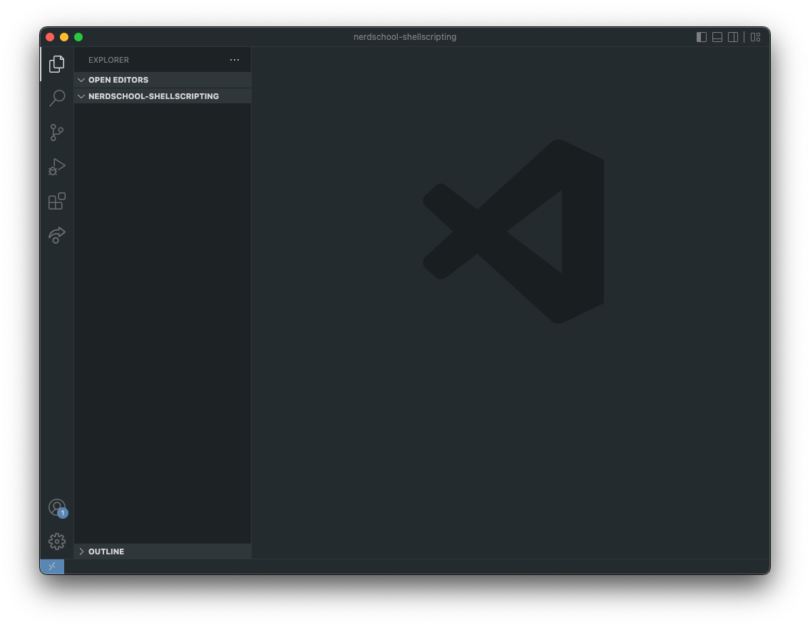
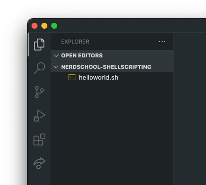

<!-- TODO: Move PATH introduction from 2.3 to this exercise -->

# Exercise 3 - Scripting

You will learn to:

- Create and execute simple bash scripts
- Add scripts to the `$PATH`

## Required software and tools for this exercise

- Bash
- Visual Studio Code

---

### 3.1 - Install required software

:book: We are going to be using [Visual Studio Code](https://code.visualstudio.com/) to create and edit script files.

:pencil2: Install Visual Studio Code by following [these instructions](https://code.visualstudio.com/docs/setup/setup-overview).

### 3.2 - Workspace setup

:book: Before we start, you need to create a temporary folder that will be your workspace for this workshop. Creating a folder inside your user "home" folder is the easiest way.

:pencil2: Open a terminal.

:book: By default, `bash` will set the current working directory to the value of the global enviroment variable `$HOME`, which will vary by OS:

- Linux: `/home/<username>`
- macOS and Windows (Git Bash): `/Users/<username>`

:pencil2: To print the current working directory (which should be your home folder), use the `pwd` command.

:pencil2: Create a subfolder of your home directory called `nerdschool-shellscripting` by using the `mkdir` command.

:pencil2: Change the working directory to this folder using the `cd` command. `pwd` should now output `<homefolder>/nerdschool-shellscripting`.

:pencil2: To open this folder as your workspace folder inside VS Code, you can launch VS Code from the command line using the `code .` command.

:exclamation: macOS-users need to follow an one-time [additional VS Code setup step](https://code.visualstudio.com/docs/setup/mac#_launching-from-the-command-line) to add the `code` command to `$PATH`.

:exclamation: If you receive a warning saying "Do you trust the authors of the files in this folder?", press "Yes, i trust the authors".

The result should be something like this:



## 3.3 - Hello world script

:book: Notice that the left side Explorer pane of VS Code is empty, because the folder you opened is empty. To create a empty file using the command line, use the command `touch <filename>`.

:pencil2: Create a file called `helloworld.sh` using the `touch` command.

:book: In VS Code, notice that you now have a file in the Explorer pane:



:book: You can of course also create files directly inside VS Code.

:pencil2: Update the contents of `helloworld.sh` with the following using VS Code:

```bash
#!/bin/bash
MESSAGE="Hello World!"
echo "$MESSAGE"
```

:exclamation: Remember to save your file.

:book: The first line in the script above is something called a "shebang": `#!/bin/bash`. It sets the target shell to be used when executing the script. The shebang is not strictly required when creating shell scripts, but is a recommended best practice. Omitting it can some times lead to compatibility issues, as some shells have different scripting syntax than others.

:book: The last two lines in the script assigns a value to a local variable and outputs it.

### Executing scripts

:book: To execute a script, use the syntax `./<scriptname.sh>`.

:pencil2: Try executing your `helloworld.sh` script this way.

:book: The command should output an error. 

```bash
bash: ./helloworld.sh: Permission denied
```

:exclamation: If you are using Windows with barebone git bash, you shell might not honor best practice and the file may be executable from the get-go. This should not be a problem with WSL or any real Unix-like system. Try to follow along anyway, as permissions is an important aspect of working with files, that you will encounter when you are working in a non-emulated unix environment.

:book: In order for a script to be executable, you need to set the _file permissons_ for the script file correctly.

### File permissions

:book: In Unix shells, scripts and programs (binaries) are both _files_. To be able to execute a script or a program, the correct file permissions must be set.

:bulb: See [Addendum - File permissions](file_permissions.md) learn more about file permissions.

:exclamation: Be careful when setting file permissions, as the wrong file permissions on the wrong set of files can lead to unintended access to your system.

:book: We use the `chmod` command to set the permissions of files. To add the execute (`x`) permission to a file for the file owner, you can use the syntax `chmod u+x <filename>`.

:pencil2: Add execute permissions for everyone to the file `helloworld.sh`.

:pencil2: Check that the permissions are correct using the `ls -l` command. The leftmost characters on each line represents the file permission settings. The correct result should be `rwxr--r--`.

:pencil2: Try executing the script again using the `./<filename>` syntax.

:book: The script should now output:

```bash
Hello World!
```

### 3.4 - Create bash scripts

:book: These tasks require you to create bash scripts that you can execute in your shell. Remember to set the correct file permissions on each script file you create.

:pencil2: Make a script that uses a for loop to print out the first few lines of each file in a directory.

:pencil2: Make a variable containing the path of a directory or a file that exists in your filesystem.
Make a test that checks whether the path is a directory or a regular file. Print `Directory` if the path is a directory, or `File` if the path is a regular file. Create a script that you can run to check the status of the path currently stored in your variable (e.g. `./filecheck.sh`).

:star: Bonus: Instead of storing the path of the file or folder you want to check, can you pass it inn as a parameter to the script? (E.g. `./filecheck.sh /home/myfolder`).

:star: Bonus: Are you able to use the variable containing the file or directory, printing the path of the file in the output? E.g. `"/home/root/file.txt" is a file`.

---

### 3.5 - Adding scripts to the $PATH

:book: If you create a script you want to use without executing it from the directory it is located in, you can add the script directory to the `$PATH` variable. Like we discussed in the previous exercise, the `$PATH` is set at startup and can be overridden using a `.bashrc` configuration file in the home directory.

:pencil2: Change the current directory to the home directory using `cd ~`. (`~` is an alias of the path to the current user´s home directory)

:pencil2: Check to see if you have a file called `.bashrc` in your home directory. Create a new empty file in the home directory called `.bashrc` if it does not already exist.

:exclamation: Notice that if you list the contents of the home directory the `.bashrc` file is hidden. This is because of the `.` prefix in the filename, which tells the OS to hide the file. To list hidden files using `ls` you can use the `-a` parameter.

:pencil2: Open the `.bashrc` file in VS Code using the `code` command and add the following:

```bash
export PATH=~/nerdschool-shellscripting:$PATH
```

Notice that we use `export` to create a environment variable.

:question: Why is `PATH` assigned the value of `$PATH`?

:exclamation: If we redefine `PATH` by doing `export PATH=/some/dir`, we loose the exiting value if we don't append it to the new value. Not retaining the predefined value of `$PATH` will cause the shell to not find any of the essential commands like `ls` and `cp`, which causes problems.

:pencil2: The `.bashrc` file is only read at startup, so to see if the `$PATH` was updated you need to start a new bash shell.

:pencil2: Try echoing out the value of `$PATH` to see if it includes the new directory we added.

:pencil2: Try executing some of the scripts inside the `nerdschool-shellscripting` directory by typing `<scriptname.sh>` while the current directory is any other directory.

### [Go to exercise 4 :arrow_right:](./exercise-4.md)
